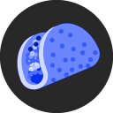

# Welcome to Robot International Documentations!

 

Wholesomemaker is a Discord Bot that have all tools you need from managing a server, engage with server members, and more...

### Introductions

This maybe a little awkward, but Welcome, Welcome, Welcome! 🥂

For specific documentations, Please check the tabs over there 👈

Let's get down to the Introduction

### Why Wholesomemaker?

The Ideas is, This bot should make everybody happy and cheerful. so, it's "Wholesome" and "Maker". and also making people happy and cheerful means _Wholesome_ to me, so.. Why not? 😁

### Story behind Wholesomemaker

- The first idea is, the bot called "Clyde" as Clyde Official Discord Bot that pops up whenever there's notice on DM's or Server Chats

- After a short period of time, Time to change the bot's name. First name comes to my mind is "Carl Johnson". I think, "ah.. okay.. imma change it to CJ". The CJ name is from a discord bot project called CJ by Southclaws, (fyi: [Click here](https://github.com/Southclaws/cj)). Contains almost same commands with the original bot, but i make it more diversify.

- Then, just a couple of months.. Renamed to "Samantha". Yes! *the* Samantha, Samsung AI Assistant because she is cute :3
    - In this period of time, i'm making something new.. Adding Slash Commands! *Yass!* **THE** Slash commands.
    - It took me 3 Weeks to work on it, so yeah.. 😁

- Just a months ago, at the time of writing this docs (October 2021). I change the bot name to Wholesomemaker.

Alright, Enough about Story and whatnot.. Let's move on to Features and Whatnot of Wholesomemaker 😎